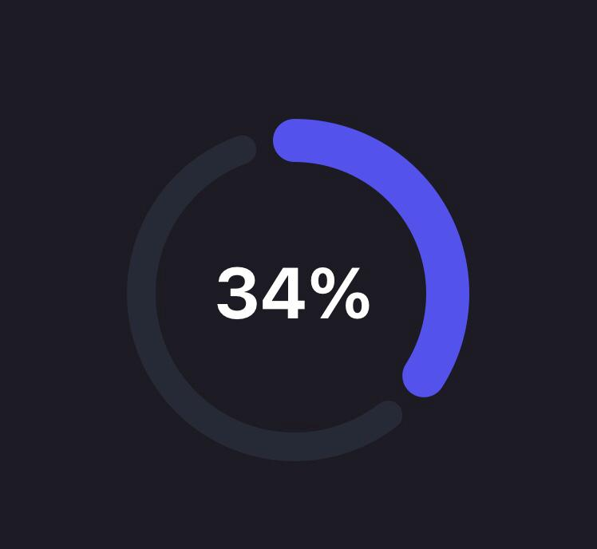

<br />
<p align="center">
  


  <h2 align="center">Progress Circle</h2>

  <p align="center">
    <strong>A modern and stylized progress circle component</strong>
    <br />
    <small>Made with svg and animated with the react-native-reanimated v2 library</small>
    <br />
    <br />
    <a href="https://docs.expo.io/versions/latest/sdk/reanimated/">Reanimated</a>
    ·
    <a href="https://docs.expo.io/versions/v40.0.0/sdk/svg/">RN-SVG</a>
  </p>
</p>


## Usage

```jsx
<ProgressCircle
  progress={35}
  progressColor="#5352EC"
  backgroundColor="#272935" />
```


# Configuration

You can configure the CircularProgress-component by passing the following props:

Name                  | Type                   | Default value           | Description
----------------------|------------------------|-------------------------|--------------
progress              | number (0-100)         | **required**            | Current progress
progressColor         | string                 | **required**            | Color of the progress line
backgroundColor       | string                 | **required**            | Color of the background line
size                  | number                 | 150                     | Width and height of circle
padding               | number                 | 4                       | Padding applied around the circle
backgroundWidth       | number                 | 12                      | Thickness of background circle
progressWidth         | number                 | 18                      | Thickness of progress circle
duration              | number                 | 800                     | Duration of the animation in milliseconds
gap                   | number                 | 20                      | Space between background line and progress line